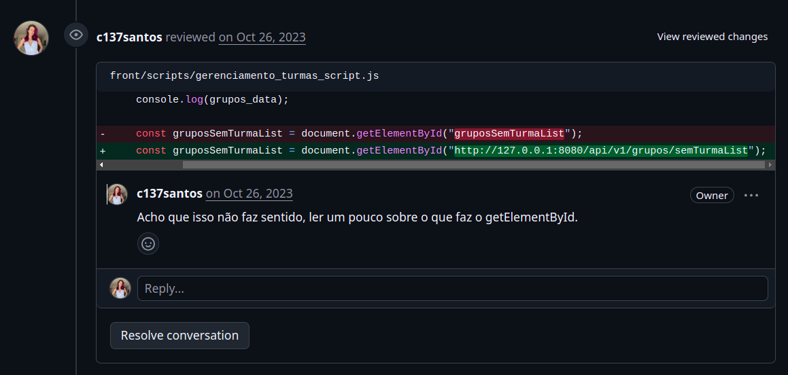
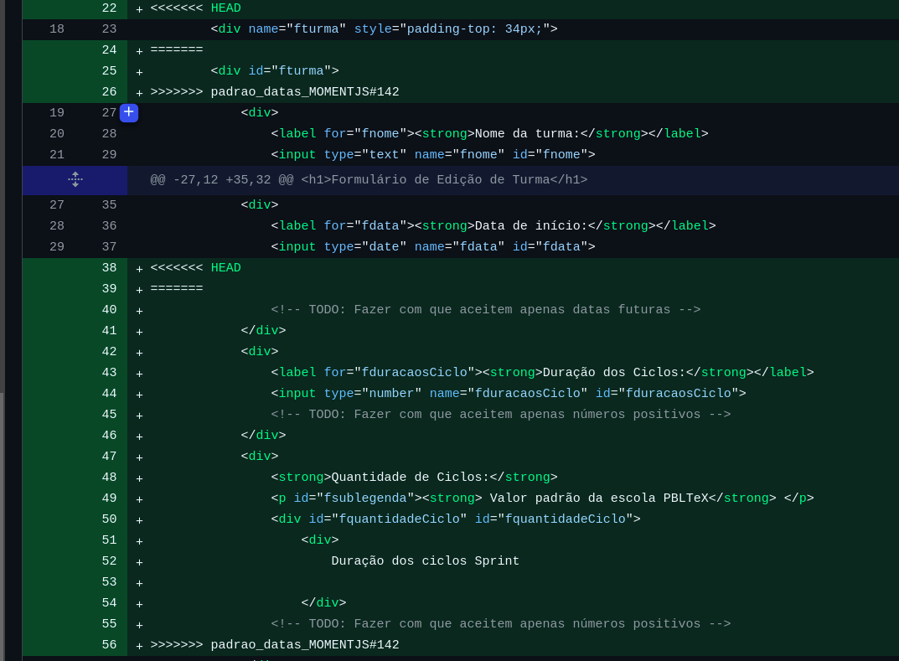

# PBLTex

Sistema educacional de gestão e acompanhamento de scores de alunos

### Primeiro Semestre (2023-2)

O projeto desenvolvido no primeiro semestre do curso teve como empresa parceira a própria FATEC São José dos Campos. Os requisitos foram apresentados pelo Prof. Fabiano Sabha Walczak (M2) e pelo Prof. Lucas Nadalete (P2), que assumiram o papel de clientes finais do projeto.

Como se tratava da primeira API, a FATEC, na figura do Prof. Fabiano Sabha foi nosso cliente. 

O problema apresentado consistia na dificuldade dos professores que utilizavam a metodologia PBL (Project Based Learning) em acompanhar o progresso e os scores de alunos organizados em grupos ao longo de múltiplos ciclos de entrega. Sem uma ferramenta dedicada, esse controle era feito de forma manual, tornando difícil visualizar rapidamente o desempenho de cada grupo e gerar relatórios consolidados ao final do semestre.

Como solução, minha equipe desenvolveu um sistema web de gestão educacional que permite o controle de turmas, grupos de alunos e ciclos de entrega. A aplicação viabiliza a importação de dados, o registro de scores parciais por ciclo e a exportação de métricas e resultados consolidados, oferecendo visibilidade clara do desempenho dos alunos ao longo do semestre.

[Repositório GitHub](https://github.com/c137santos/FATEC-API-1-SEMESTRE)

#### Tecnologias Utilizadas

As seguintes tecnologias foram utilizadas nesse projeto:

* Python - linguagem utilizada no back-end e para implementação do servidor WSGI de comunicação com o front-end;
* JavaScript - linguagem utilizada no front-end para interatividade das telas;
* HTML e CSS - utilizados na estruturação e estilização das páginas do sistema;
* Git e GitHub - controle de versão com fluxo de fork e pull request.

#### Contribuições Pessoais

Nesse projeto atuei como Scrum Master e desenvolvedora. Por ser a integrante com maior experiência técnica da equipe, fui responsável por definir e implementar a arquitetura MVC do sistema, desenvolvendo do zero um servidor WSGI em Python puro para comunicação entre frontend e backend, seguindo a especificação PEP 333. Também estabeleci o fluxo de trabalho com Git, implementando o processo de fork e pull request com obrigatoriedade de ao menos um code review de aprovação antes do merge, garantindo rastreabilidade e qualidade nas entregas.

Para apoiar os membros com dificuldades com Git e com o servidor WSGI, elaborei uma documentação técnica com roadmap das tecnologias utilizadas, disponibilizada em uma página dedicada do projeto.

#### Hard Skills

Exercitei as seguintes hard skills durante esse projeto:

* Python - uso com autonomia;
* JavaScript - uso com autonomia;
* HTML e CSS - uso com autonomia;
* Git - uso com autonomia.

#### Soft Skills

Nesse projeto exercitei minha liderança técnica para orientar uma equipe com pouca experiência em programação. Ao perceber que os membros tinham dificuldades recorrentes com Git e com o modelo de comunicação via WSGI, tomei a iniciativa de criar documentação didática e conduzir sessões de apoio individuais, evitando que o progresso do projeto fosse bloqueado por lacunas de conhecimento.

Também utilizei minha comunicação proativa ao identificar que a ausência de critérios claros de avaliação dos professores estava gerando ruídos que afetavam as entregas. Propus a criação de documentos descritivos detalhados sobre o que era esperado em cada sprint — prática que foi adotada como padrão nas turmas seguintes.


#### Contribuições Individuais

Implementei o processo de desenvolvimento do git com fork e PR autorizados apenas com um CR de aprovação. Definido o ciclo de code review desde primeira sprint. 

Estabaleci arquitetura MVC,com frontend se conectando por meio de WSGI desenvolvido por mim. 

Para auxiliar e profundar com os colegas sobre github e sistema de WSGI, foi contruído, junto com a SM, uma documentação explicativa das tecnologias utilizadas e um roadmap [nessa página](https://c137santos.github.io/FATEC-API-1S-DOCUMENTS/)

#### Dificuldade

A principal dificuldade esteve na falta de alinhamento entre as expectativas dos professores, os critérios de avaliação e o entendimento dos alunos sobre o resultado esperado. Essa falta de clareza gerou discussões e ruídos de comunicação, evidenciando a necessidade de documentos mais detalhados e objetivos sobre os pontos que seriam avaliados e o que era esperado em cada entrega. Como resultado, tornou-se obrigatório nas turmas seguintes receber documentos descritivos para garantir maior transparência e entendimento entre todos os envolvidos.

Além disso, a inexperiência natural dos alunos do 1º semestre, aliada ao uso indiscriminado de ferramentas como o ChatGPT sem o devido embasamento teórico, resultou em códigos que, por vezes, não atendiam aos requisitos do projeto.

Esse cenário evidenciou a importância de um acompanhamento mais próximo e de orientações claras sobre o uso adequado dessas ferramentas, reforçando a necessidade de desenvolver uma base sólida de conhecimentos antes de recorrer a soluções automatizadas. Que por muitas vezes tem uma posição pasiva dos  professore, achando que os alunos saberão perguntar. 



Além de uma dificuldade considerável dos alunos com os github. Que foi agravado ao trabalhar com o fork e pr. Ex:



Para sanar essa dúvida, como SM fiz uma documentação para explicar como poderia ser trabalhado nesse formato. Pode ser consultado [nessa página](https://c137santos.github.io/FATEC-API-1S-DOCUMENTS/biblioteca/#depois-de-ter-branch-s-01-criada)

## Aprendizados e ganhos com o projeto.

Estudo aprofundado sobre o desenvolvimento do WGSI e a compreensão do ciclo de vida de uma requisão HTTP. UM protocolo para comunicação com servidor proposto pela [PEP333](https://peps.python.org/pep-0333/).

Aprendemos a criar e manipular objetos HTTPRequest, entendendo como acessar informações essenciais da solicitação, como método, cabeçalhos, URL e parâmetros. Também assimilamos como mapear URLs para funções (views) responsáveis por gerar as respostas, além de estruturar o retorno ao servidor, incluindo o uso correto dos códigos de status e cabeçalhos HTTP. Esse entendimento foi fundamental para garantir que as respostas fossem entregues de forma adequada ao navegador, permitindo a comunicação eficiente entre frontend e backend.

O trecho a seguir utiliza esse WGSI para subir o servidor e deixa-lo disponível a requisições. 

```
def retorna_response(environ, start_response):
    from urls import url_match
    """
    Essa é a função desenhada no padrão WSGI. Recebe request do navegador e gera response adequado.
    Args:
        environ (dict): Conteúdo preenchido pelo servidor. 
        Como o método HTTP, cabeçalhos, URL, parâmetros de consulta e outras informações relacionadas à solicitação.
        start_response (str): callback enviado pelo servidor para acionar a requisição
        """
    request = HTTPRequest(environ)
    view = url_match(request.path)
    response = view(request)
    start_response(response.status, list(response.headers.items()))
    return response

if __name__ == '__main__':
    print(f"🚀 Servidor HTTP rodando! 🚀 \n Acesse o servidor em: localhost:8080")
    server = make_server("127.0.0.1", 8080, retorna_response)
    server.serve_forever()

```

Isso permitiu que fosse possível realizar solicitações do frontend para backend.